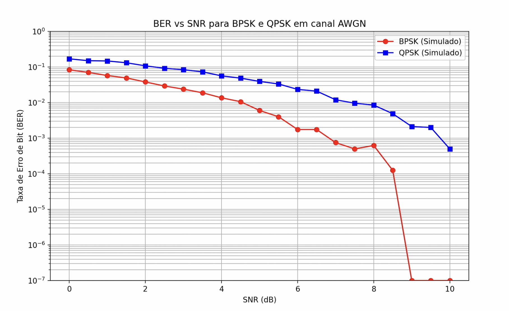

# Simulação de Transmissão Digital

Este projeto é uma ferramenta de simulação desenvolvida em Python para demonstrar uma implementação de um sistema completo de transmissão digital, que inclui:

- Geração ou inserção de uma String em ASCII para a transmissão
- Conversão dessa String para binário
- Aplicação do codificador de canal Manchester
- Modulação por QPSK e BPSK
- Adição de ruído no canal (AWGN)
- Demodulação e decodificação dos dados recebidos

No resultado será visualizado as formas das ondas depois de cada etapa, além de um gráfico estatístico de Taxa de Erro de Bit (BER) em função da Razão Sinal-Ruído por Bit.

## Pré-requisitos

Certifique-se de ter o Python 3 instalado. Você precisará das seguintes bibliotecas científicas:

```bash
pip install numpy matplotlib scipy
```

## Execução

Execute o script principal no terminal:

```bash
python main.py
```

O programa solicitará que você escolha o modo de operação:

- `i`: para inserir uma string para ser processada
- `g`: para que o sistema gere uma string aleatória para você. Nesse caso, será requisitado o tamanho desejado da mensagem.

## Arquitetura e Funcionamento do Código

A simulação foi construída de forma modular, onde cada bloco representa uma etapa real de um sistema de comunicação digital. A seguir, descrevemos cada parte da arquitetura e o seu papel no fluxo completo da transmissão.

---

## 1. **Entrada da Mensagem**

O usuário pode escolher entre duas opções:

- **Inserir manualmente** uma string ASCII.
- **Gerar automaticamente** uma sequência aleatória de caracteres.

Essa mensagem é o ponto de partida de todo o sistema de transmissão digital.

---

## 2. **Codificação ASCII → Binário**

A partir da string de entrada (inserida ou aleatória), cada caractere é convertido para seu equivalente ASCII em 8 bits.

Exemplo:

`'a' → 01100001`


O resultado é uma sequência binária contínua que será codificada e modulada.

---

## 3. **Codificação de Linha Manchester**

Após a conversão para binário, aplica-se a codificação Manchester:

- bit **1** → `[+1, -1]`  
- bit **0** → `[-1, +1]`

Funções principais do código Manchester:

- garantir sincronização de clock (uma transição por bit)
- remover componente DC
- gerar níveis (+1 e –1) adequados para modulação analógica

---

## 4. **Modulação do Sinal**

A simulação implementa duas técnicas de modulação digital: **BPSK** e **QPSK**.

---

### 4.1 **Modulação BPSK**

Cada nível Manchester é multiplicado por uma portadora senoidal:

\[
s(t) = m(t) \cdot \cos(2\pi f_c t)
\]

Onde:

- `m(t)` = nível Manchester (+1 ou –1)
- `f_c` = frequência da portadora

Essa modulação transmite **um bit por símbolo**.

---

### 4.2 **Modulação QPSK**

A sequência Manchester é agrupada em pares: \((I, Q)\).

O sinal QPSK gerado é:

\[
s(t) = \frac{1}{\sqrt{2}} \left(I \cos(2\pi f_c t) + Q \sin(2\pi f_c t)\right)
\]

Onde:

- **I** e **Q** ∈ {+1, –1}
- o fator \(1/\sqrt{2}\) normaliza a energia do símbolo

A QPSK transmite **dois bits por símbolo**, aumentando a eficiência espectral.

---

## 5. **Canal com Ruído AWGN**

O canal simulado adiciona ruído gaussiano branco aditivo (AWGN) ao sinal:

- distribuição normal
- média zero
- variância ajustada ao valor desejado de **Eb/N₀**

A simulação calcula automaticamente o sigma correto para cada modulação, garantindo realismo físico.

---

## 6. **Demodulação**

O sinal recebido com ruído passa por um processo inverso à modulação.

---

### 6.1 **Demodulação BPSK**

A demodulação é feita por detecção coerente:

- correlação com a portadora
- integração por símbolo
- decisão do sinal (positivo → +1, negativo → –1)

O resultado é um sinal Manchester recuperado.

---

### 6.2 **Demodulação QPSK**

Para cada símbolo:

- correlaciona com **cos** → componente I  
- correlaciona com **sin** → componente Q  
- toma-se a decisão com base no sinal de I e Q:

I > 0, Q > 0 → (+1, +1)

I < 0, Q > 0 → (−1, +1)

I < 0, Q < 0 → (−1, −1)

I > 0, Q < 0 → (+1, −1)


Esses pares correspondem aos níveis Manchester originais.

---

## 7. **Decodificação Manchester → Binário**

Após a demodulação, cada par Manchester é convertido de volta:

- `[+1, -1]` → bit **1**
- `[-1, +1]` → bit **0**

Obtém-se novamente a sequência binária da mensagem transmitida.

---

## 8. **Conversão Binário → ASCII**

Os bits são agrupados em bytes e convertidos para caracteres ASCII, recuperando a mensagem original (salvo erros induzidos pelo ruído).

---

## 9. **Cálculo da Taxa de Erro de Bit (BER)**

A BER é definida como:

\[
BER = \frac{\text{número de bits errados}}{\text{total de bits transmitidos}}
\]

A simulação repete várias transmissões para cada valor de **Eb/N₀**, resultando em estimativas estatisticamente mais estáveis.

---

## 10. **Visualização Gráfica**

A simulação exibe:

### Formas de onda:
- sinal Manchester  
- BPSK (limpo e com ruído)  
- QPSK (limpo e com ruído)

### Curva BER × Eb/N₀:
Com os resultados de:

- **BPSK (simulado)**
- **QPSK (simulado)**  

Essa comparação valida que BPSK e QPSK têm **desempenho energético equivalente**, como previsto pela teoria.

---

## Testes e Resultados

Para validar o sistema de transmissão digital, realizamos dois cenários de teste:

1. **Mensagem inserida manualmente**: `"computador"`  
2. **Mensagem gerada aleatoriamente**: [adicionar]

Em ambos os casos, o programa executa todas as etapas do fluxo digital:  
codificação Manchester, modulação (BPSK e QPSK), inserção de ruído AWGN, demodulação, decodificação e cálculo da BER.

A seguir descrevemos os resultados obtidos para cada etapa da transmissão.

---

## Formas de Onda do Sistema

As figuras abaixo mostram a evolução completa do sinal ao longo da transmissão:

**Entrada: `computador`**


**Entrada:`y    9PW*>   /
                                         4Zx5dF^hl}9j8;l,LeHFT Hg=
~-L\0GT}>|&E<'eI(&Fs1HUJO
                 |O/Blbum~[A&vK"F+Ai4sapw`**


As imagens são composta por cinco subgráficos, representando cada etapa do pipeline digital:

---

### **1. Codificação Manchester**
- Cada bit da mensagem é convertido em dois níveis:
  - `1` → `[+1, -1]`
  - `0` → `[-1, +1]`
- A transição obrigatória por bit melhora a sincronização no receptor.
- O gráfico evidencia claramente o padrão alternado característico desse código.

---

### **2. BPSK — Sinal Modulado**
- Cada nível Manchester modula diretamente uma portadora cossenoidal.
- `+1` mantém a fase; `-1` inverte a fase em 180°.
- O resultado é um sinal senoidal alternando entre duas fases fixas.

---

### **3. BPSK com Ruído (AWGN)**
- Após atravessar o canal com ruído gaussiano:
  - Para **SNR baixo**, a forma da portadora se torna menos reconhecível.
  - Para **SNR alto**, o sinal preserva mais características originais.
- A diferença visual entre o sinal limpo e o ruidoso destaca o impacto do AWGN.

---

### **4. QPSK — Sinal Modulado**
- Os níveis Manchester são agrupados em pares → símbolos (I, Q).
- O sinal final é composto por:
  - componente em fase (cos)
  - componente em quadratura (sin)
- Como cada símbolo carrega **dois bits**, a modulação atinge o dobro da eficiência espectral do BPSK.

---

### **5. QPSK com Ruído (AWGN)**
- O ruído interfere tanto na amplitude quanto na fase.
- Apesar de mais eficiente, o QPSK tende a ser mais sensível ao ruído.
- Ainda assim, para SNR alto, o receptor reconstrói adequadamente a sequência Manchester.

---

## Curva BER × SNR (BPSK vs QPSK)

As figuras a seguir (`BERvsSNR-1.png`) apresentam a comparação entre as modulações com SNR variando de **0 a 10 dB**:

**Entrada: `computador`**


**Entrada:`y    9PW*>   /
                                         4Zx5dF^hl}9j8;l,LeHFT Hg=
~-L\0GT}>|&E<'eI(&Fs1HUJO
                 |O/Blbum~[A&vK"F+Ai4sapw`**


Cada ponto foi obtido com **100 simulações**, garantindo robustez estatística.

### Principais observações:

- A **BER diminui à medida que o SNR aumenta**, para ambas modulações.
- **BPSK** apresenta melhor desempenho:
  - sua curva está sempre abaixo da curva do QPSK.
  - atinge BER praticamente zero para SNR acima de ~8 dB.
- **QPSK** exige SNR maior para alcançar BER semelhante, pois transmite mais informações por símbolo.
- Apesar disso, QPSK mantém a vantagem de **eficiência espectral dobrada**, justificando seu uso em cenários onde a banda é mais limitada.

---

## Comparação entre os Cenários de Teste

### 1. **Mensagem “computador”**
- Excelente para ilustrar claramente todo o pipeline digital.
- Mostra de forma didática a relação entre os bits, o sinal Manchester e os símbolos gerados.

### 2. **Mensagem Aleatória** 
- Demonstra a robustez da simulação com inputs não previsíveis.
- Permite validar o sistema em condições mais próximas das reais.
- Mantém o mesmo comportamento nos gráficos:  
  BPSK melhor em BER; QPSK mais eficiente em termos de banda.

Ambos os cenários produzem resultados consistentes e alinhados com a teoria de comunicações digitais.

---

## Vídeo com a execução e explicação dos testes

Os testes apresentados foram demonstrados e analisados com mais detalhes no seguinte vídeo:
[Clique Aqui para Ver o Vídeo](https://www.youtube.com/watch?v=1QjkQO2DFw0)

---

## Conclusão dos Testes

Os experimentos comprovam que:

- A codificação Manchester foi aplicada corretamente.
- As modulações BPSK e QPSK foram implementadas com fidelidade.
- O canal AWGN influencia diretamente a BER, como esperado.
- O sistema reconstrói a mensagem original com alta precisão para SNR elevados.
- BPSK → menor BER  
- QPSK → maior eficiência espectral  

Esses testes demonstram que o sistema se comporta como um **enlace digital realista**, permitindo estudar com clareza o impacto da modulação e do ruído na comunicação.


----
**Alunas:** Cinthia Becher e Gabrielle Bussolo

